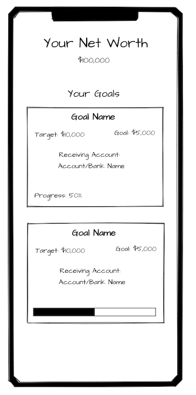

## Getting started

1. Install the dependencies
   ```
   npm install
   ```
2. Start the API
   ```
   npm run api
   ```
   This starts an API on port `8080`.

## Requirements

Your goal is to build a view that looks like this and it should:

- Display a list of financial goals, including the bank account linked to each goal.
- Display your net worth at the top. This is calculated by adding up the balance of all the bank accounts.
- It should show "Not available" if the a goal has none-existing bank account.

Bonus:
- Show a loading label while the API is being fetched.
- Show a progress bar instead of % in the goal card.



You have access to an API with two endpoints:

- `/financialGoals`
- `/bankAccounts`
